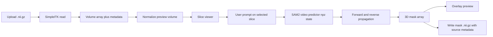

# NIfTI Interactive Segmentation Web UI Design

## Goal

Add a web page for interactive MedSAM2 segmentation of `.nii.gz` medical volumes. The page should let a user upload one NIfTI file, browse slices, provide a prompt on a selected slice, run 3D propagation, preview the mask overlay, and download the predicted mask as `.nii.gz`.

## Scope

In scope:

- A dedicated NIfTI Gradio entry point, separate from the existing video demo.
- Upload and read `.nii.gz` files with SimpleITK.
- Preserve source image metadata when exporting masks.
- Axial slice browsing with a slider.
- Interactive prompts on the current slice, prioritizing box prompts and leaving point prompts as a small extension if Gradio event support is straightforward.
- MedSAM2 3D propagation from the prompted slice using the existing `build_sam2_video_predictor_npz` flow.
- Mask overlay preview and downloadable mask output.

Out of scope for the first version:

- Multi-volume batch processing.
- Multi-class editing workflows beyond a single foreground object.
- Full radiology viewer features such as window presets, measurements, or multi-planar reconstruction.
- Training or model weight download automation.

## Architecture

Create a focused backend module, tentatively `nii_inference.py`, and a web entry point, tentatively `nii_app.py`.

`nii_inference.py` owns NIfTI and model operations:

- Load a `.nii.gz` file with SimpleITK.
- Convert the volume to a NumPy array in `(D, H, W)` order.
- Normalize intensities to uint8 for preview and model input.
- Prepare the volume tensor with the existing `prepare_video_volume` helper.
- Initialize `build_sam2_video_predictor_npz`.
- Run segmentation from a selected slice and prompt.
- Export a mask NIfTI with metadata copied from the source image.

`nii_app.py` owns the Gradio UI:

- File upload.
- Config and checkpoint selection.
- Slice index slider and preview image.
- Prompt controls.
- `Segment` and `Reset` actions.
- Overlay preview and mask file download.

This keeps the existing `app.py` video demo stable and avoids importing `medsam2_infer_3D_CT.py`, which currently executes command-line inference at import time.

## User Flow

1. Start the page with `python nii_app.py`.
2. Upload a `.nii.gz` image.
3. The app loads metadata, normalizes the volume, and shows the middle slice.
4. Move the slice slider to the target slice.
5. Draw a prompt on the slice. The first implementation treats a sketch mask's bounding rectangle as the box prompt.
6. Click `Segment`.
7. The backend runs forward and reverse propagation from the prompted slice.
8. The page shows an overlay for the current slice and provides a downloadable mask `.nii.gz`.

## Data Flow

## Prompt Behavior

The first version uses a box prompt because it matches the existing 3D CT script and is reliable for MedSAM2 propagation.

- The user draws a rough stroke or region over the target on the current slice.
- The backend converts that drawn mask to `[x_min, y_min, x_max, y_max]`.
- The selected slice index becomes `frame_idx`.
- Object id is fixed to `1` for the initial version.

If point selection is easy to wire with the installed Gradio version, the UI may also support positive and negative click prompts, but box prompting remains the required path.

## Error Handling

The page should report clear messages for:

- Missing upload.
- Unsupported file extension.
- Failed NIfTI read.
- Empty prompt mask or invalid bounding box.
- Missing checkpoint or config file.
- CUDA/model initialization failure.
- Export failure.

Temporary output files should be written under a per-session directory to prevent collisions between runs.

## Testing

Backend tests should cover behavior that does not require loading a real model:

- NIfTI metadata round trip for a small synthetic volume.
- Intensity normalization shape and dtype.
- Conversion from drawn prompt mask to bounding box.
- Mask export preserves shape and spatial metadata.
- Invalid prompt masks raise a useful error.

Manual verification should cover:

- Launching `python nii_app.py`.
- Uploading a small `.nii.gz`.
- Browsing slices.
- Drawing a box prompt.
- Running segmentation with available checkpoint/config.
- Downloading and reloading the output mask.

## Acceptance Criteria

- `python nii_app.py` launches a local Gradio page.
- A user can upload a `.nii.gz` volume and view slices.
- A user can draw a prompt on a selected slice and start segmentation.
- The app produces a 3D binary mask.
- The app writes a downloadable `.nii.gz` mask with source image metadata copied.
- Existing video demo behavior in `app.py` is unchanged.
